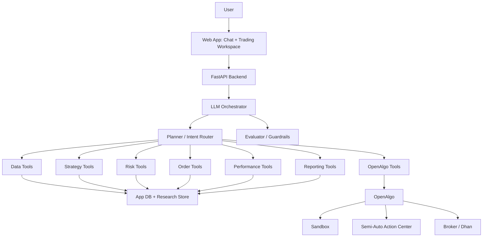

# IIMC Conversational Algo-Trading Platform: 16-Week Comprehensive Production Plan

## 1. Product Goal

Build a production-ready conversational algo-trading platform where a user can
ask trading, research, portfolio, execution, and reporting questions in natural
language, and the system routes those requests to reliable backend tools.

The platform should feel like a serious trading research and execution workspace,
not a fixed demo bot. The user should be able to ask many kinds of questions:

- "What data do we have for NIFTY options?"
- "Backtest this strategy on last month's data."
- "Why was this order rejected by risk?"
- "Show all trades from today's sandbox run."
- "Compare two strategy runs."
- "Generate a professor-ready explanation of the backend workflow."
- "Inspect OpenAlgo sandbox positions and funds."

The LLM does orchestration and explanation. It must not invent market data,
signals, orders, risk decisions, or performance numbers.

## 2. Non-Negotiable Design Principles

1. Backend facts first
   - Every meaningful answer should be grounded in stored data, tool output, or
     OpenAlgo state.

2. Deterministic trading logic
   - Strategies, risk checks, order formatting, and performance calculations
     must be normal backend code, not prompt-only logic.

3. Full audit trail
   - Every user request, tool call, strategy run, risk decision, order, trade,
     and explanation should be traceable.

4. Safe execution path
   - Research and sandbox come first.
   - Semi-auto requires human approval.
   - Live mode is optional and heavily guarded.

5. Modular agentic architecture
   - The system should support new strategies, datasets, brokers, reports, and
     tools without rewriting the chatbot.

## 3. Mandatory Planning Gate

Before every week, sprint, module, or major feature, we must check:

- Product completeness: does this advance the real production platform?
- Architecture completeness: does it fit the layers cleanly?
- Data and audit completeness: can we trace where every important result came from?
- Safety completeness: does it keep research, sandbox, semi-auto, and live paths separated?
- Testing completeness: what proof shows it works?
- Interview understanding: can the design be explained clearly?
- Demo value: what can be shown from real stored outputs?

Nothing should be started until the deliverable, storage impact, tests, production
relevance, and learning points are clear.

## 4. Target Architecture

## 5. Production Modules

### 4.1 Web Application

Purpose:

- give the user a serious workspace, not only a chat box

Views:

- chat workspace
- data catalog
- strategy lab
- run detail page
- risk/order timeline
- performance dashboard
- OpenAlgo monitor
- report viewer

### 4.2 API Backend

Purpose:

- expose all backend capabilities through typed endpoints

Core endpoints:

- `POST /chat`
- `GET /datasets`
- `POST /datasets/ingest`
- `POST /strategies/run`
- `GET /runs/{run_id}`
- `GET /runs/{run_id}/timeline`
- `GET /runs/{run_id}/performance`
- `GET /runs/{run_id}/explain`
- `GET /openalgo/status`
- `GET /openalgo/sandbox`
- `POST /reports`

### 4.3 Orchestrator

Purpose:

- convert user intent into a safe sequence of tool calls

Responsibilities:

- classify request
- plan tool sequence
- call deterministic tools
- handle missing data or ambiguity
- ask clarification when necessary
- send result through evaluator before final response

### 4.4 Tool Layer

Tools are backend functions with typed inputs and outputs.

Initial tool groups:

- data catalog tools
- ingestion tools
- strategy tools
- risk tools
- order tools
- performance tools
- OpenAlgo inspection tools
- reporting tools

Later these can be exposed through MCP, but we should start with direct FastAPI
tool calls to avoid unnecessary framework complexity.

### 4.5 Data Layer

Development:

- DuckDB for fast local research data
- SQLite/DuckDB acceptable for early app state

Production target:

- PostgreSQL for app state, audit, users, sessions, orders, reports
- DuckDB/Parquet for local analytical research datasets

Core data domains:

- market data
- strategy definitions
- strategy runs
- signals
- risk decisions
- order events
- trades/fills
- positions
- performance
- chat sessions
- tool calls
- reports
- OpenAlgo snapshots

### 4.6 OpenAlgo Integration

The platform should use OpenAlgo as an execution and broker integration layer.

Stages:

1. Read-only inspection
   - inspect orders, trades, positions, funds, analyzer logs, sandbox data

2. Sandbox bridge
   - send approved paper orders to OpenAlgo sandbox
   - retrieve sandbox order/trade/position state

3. Semi-auto bridge
   - submit orders to Action Center
   - require human approval

4. Live bridge
   - optional final stage
   - strict approvals and risk limits

## 6. Agent Structure

Use a simple orchestrator-first architecture initially.

### Required Agents

1. Orchestrator Agent
   - main controller
   - chooses tools and workflow

2. Data Agent
   - dataset discovery, quality, retrieval

3. Strategy Agent
   - strategy selection and run execution

4. Risk Agent
   - pre-trade validation and risk explanation

5. Order Agent
   - order payload creation, routing, reconciliation

6. Performance Agent
   - P&L, drawdown, comparison, charts

7. OpenAlgo Agent
   - inspect and interact with OpenAlgo safely

8. Report Agent
   - professor-ready and user-ready reporting

9. Evaluator Agent
   - checks grounding, safety, and answer quality

### Why Not Start With A Heavy Multi-Agent Framework?

For the first production version, direct orchestration is better:

- easier to debug
- easier to test
- easier to explain to professor/interviewers
- less framework lock-in

MCP or LangGraph-style workflows can be added once the tool contracts are stable.

## 7. 16-Week Roadmap

The first 12 weeks build the production-grade MVP. Weeks 13-16 are intentionally
reserved for completeness, hardening, polish, documentation, demo rehearsal, and
interview readiness. Week 12 is not treated as the final finish line.

### Week 1: Foundation And Repo Shape

Goal:

- establish the production project skeleton
- define contracts before adding many features

Build:

- backend package structure
- configuration system
- database schema baseline
- typed domain models
- local development commands
- initial tests
- architecture decision record

Deliverables:

- clean repo structure
- app can initialize database
- core domain models exist
- first test suite passes

### Week 2: Data Catalog And Ingestion

Goal:

- make data discoverable and auditable

Build:

- dataset registry
- market data ingestion
- data quality checks
- catalog search
- dataset detail API

Deliverables:

- user can ask/list what data exists
- datasets have row counts, date ranges, quality status

### Week 3: Strategy Run Engine

Goal:

- create generic strategy execution infrastructure

Build:

- strategy definition model
- strategy run lifecycle
- signal storage
- parameter validation
- run status tracking

Deliverables:

- any strategy can run through the same lifecycle
- run output is stored and retrievable

### Week 4: Risk Management Engine

Goal:

- separate signal from executable order

Build:

- risk limit models
- risk decision records
- quantity sizing
- exposure checks
- rejection reasons

Deliverables:

- every order intent has an auditable risk decision

### Week 5: Order Management And Sandbox Abstraction

Goal:

- implement order lifecycle independent of broker

Build:

- order intent model
- order event model
- simulated order manager
- fills/trades model
- position updates

Deliverables:

- backend can explain order state transitions without OpenAlgo dependency

### Week 6: OpenAlgo Read-Only Integration

Goal:

- deeply map and retrieve OpenAlgo state

Build:

- OpenAlgo database inspector
- sandbox order/trade/position/fund readers
- analyzer log reader
- service-flow documentation

Deliverables:

- professor can see where OpenAlgo stores order/risk/trade/performance state

### Week 7: OpenAlgo Sandbox Bridge

Goal:

- connect approved platform decisions to OpenAlgo sandbox

Build:

- order JSON adapter
- sandbox submission
- status polling/reconciliation
- OpenAlgo-to-platform snapshot storage

Deliverables:

- signal -> risk -> platform order -> OpenAlgo sandbox order -> trade/funds

### Week 8: FastAPI Tool Backend

Goal:

- expose backend capabilities cleanly

Build:

- REST endpoints
- typed request/response schemas
- run timeline endpoint
- report endpoint
- OpenAPI docs

Deliverables:

- frontend and orchestrator can call stable APIs

### Week 9: Conversational Orchestrator

Goal:

- make natural language useful and grounded

Build:

- intent routing
- tool selection
- structured tool calls
- evaluator pass
- chat session logging

Deliverables:

- user can ask real questions and receive grounded answers

### Week 10: Frontend Workspace

Goal:

- build the usable product interface

Build:

- chat UI
- data catalog page
- run detail page
- timeline view
- performance dashboard
- OpenAlgo monitor

Deliverables:

- functional web app for demos and daily use

### Week 11: Reporting, Testing, And Hardening

Goal:

- make the system defensible and stable

Build:

- professor report generator
- error handling
- test coverage
- logging
- audit views
- security review

Deliverables:

- repeatable demo reports
- stable system behavior under failures

### Week 12: Production MVP Integration

Goal:

- integrate the major modules into a coherent production-grade MVP

Build:

- end-to-end workflow checks
- frontend-backend integration pass
- orchestrator-to-tool integration pass
- OpenAlgo sandbox/semi-auto demo path
- MVP documentation

Deliverables:

- production MVP demo
- integrated chat-to-tools workflow
- integrated data-to-report workflow
- list of remaining hardening gaps for Weeks 13-16

### Week 13: Gap Audit And Edge-Case Hardening

Goal:

- find and close missing requirements before final polish

Build:

- full requirement traceability matrix
- query coverage review
- edge-case tests
- data failure tests
- OpenAlgo unavailable/error-state handling
- malformed user request handling

Deliverables:

- no-miss requirement checklist
- known-risk register
- hardened error behavior

### Week 14: Testing, Security, And Reliability

Goal:

- make the system defensible as production-minded software

Build:

- broader automated test coverage
- API contract tests
- database idempotence tests
- audit-log verification
- security review for credentials and live-trading guardrails
- reproducible setup checks

Deliverables:

- stronger test suite
- security and safety checklist
- reliability notes

### Week 15: Documentation, Reports, And Interview Preparation

Goal:

- make the project explainable from top to bottom

Build:

- architecture document
- database/table dictionary
- OpenAlgo workflow explanation
- agent/tool explanation
- professor demo report
- interview Q&A notes
- trade-off and alternative-design notes

Deliverables:

- final technical documentation
- professor-ready report
- interview preparation pack

### Week 16: Final Polish And Demo Rehearsal

Goal:

- make the final submission polished, stable, and confident

Build:

- UI polish
- demo script rehearsal
- final bug fixing
- final screenshots/charts
- final code walkthrough
- final presentation narrative

Deliverables:

- final platform demo
- final code walkthrough
- final professor presentation narrative
- final interview-ready explanation

## 8. What We Start Building Now

We start with Week 1.

Immediate engineering tasks:

1. Restructure the project into production-style folders.
2. Create domain models for datasets, strategies, signals, risk, orders, trades,
   reports, and chat sessions.
3. Add a database initialization command.
4. Add a configuration file.
5. Add a minimal test setup.
6. Keep the old demo code as reference only, not as the center of the project.

## 9. Week 1 Definition Of Done

Week 1 is done when:

- the repo has a clean backend structure
- database initialization works from one command
- core tables are created
- core domain models are typed
- at least one smoke test passes
- README explains how to run the local backend foundation

## 10. Comprehensive Coverage Checklist

Before final submission, verify coverage across all major project dimensions:

- User experience: chat, data catalog, run details, performance, reports, OpenAlgo monitor
- Data: ingestion, catalog, quality, retrieval, source traceability
- Strategy: definitions, parameters, runs, signals, versioning
- Risk: limits, approvals, rejections, sizing, explanations
- Orders: intents, payloads, states, fills, reconciliation
- OpenAlgo: read-only inspection, sandbox bridge, semi-auto flow, safety boundaries
- Performance: P&L, drawdown, fees, win/loss, comparisons, visual summaries
- Agentic layer: orchestrator, tool calls, evaluator, logging, grounded responses
- Audit: chat sessions, tool calls, run IDs, report artifacts, snapshots
- Testing: unit, smoke, API, data, error, idempotence
- Documentation: architecture, setup, schema, OpenAlgo mapping, demo script, interview notes
- Safety: no casual live execution, credential handling, explicit approvals, failure handling

## 11. Final Definition Of Done

The project is complete when:

- a user can ask broad trading questions in natural language
- the orchestrator calls backend tools instead of hallucinating
- data, signals, risk, orders, trades, and reports are stored with audit trail
- OpenAlgo sandbox and semi-auto workflows are demonstrated
- performance analytics and explanations are visible in the UI
- the codebase has tests, documentation, and production-style structure
- the professor can understand the backend workflow end to end
