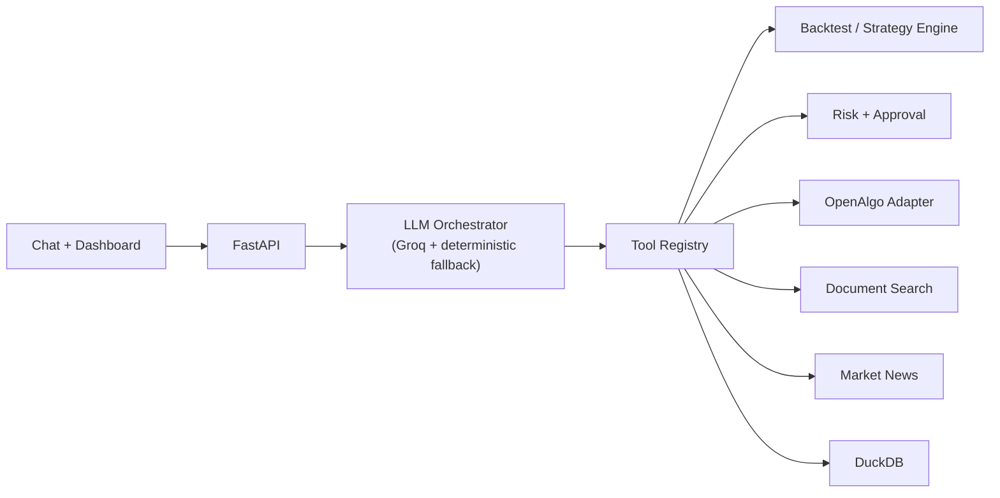

# Conversational Algo-Trading Platform

A local-first research platform for algorithmic trading that you drive through
plain-language chat. Ask for a quote, pull news, research a company, screen the
NIFTY 50, backtest a strategy you describe in English, discover a profitable
configuration, or place and track an order — all from one conversation, backed by
real market data through [OpenAlgo](https://openalgo.in).

On top of the single-tool fast path sits a small **agent layer**: parallel
multi-analyst research, an iterative self-critiquing deep-research loop, a
strategy-discovery optimizer, and long-term memory. Every agent is read-only or
prepare-for-approval — none can move money on its own — and none fabricates data.

Built with **FastAPI**, **DuckDB** (single-file storage), a **Groq**-routed LLM
orchestrator with a deterministic fallback, **LangGraph** for the iterative agent,
and a dependency-free vanilla-JS dashboard. Live trading is off by default and
every order requires your explicit approval.

## What you can do (all from chat)

- **Market data** — live quotes and news; the symbol resolver refuses rather
  than guessing, so you never get the wrong company's price.
- **Research** — fundamental analysis from imported statements, and document
  search over reports/transcripts. Name a document you don't have and it will
  fetch, index, and answer from a public source on its own.
- **Research agents** — `"research RELIANCE"` fans out to valuation,
  fundamentals, technicals, and news specialists in parallel; `"deep dive on
  RELIANCE"` runs an iterative loop that assesses its own coverage and pulls a
  **cited** source when data is thin. Read-only; every claim is traceable.
- **Memory** — `"remember that I prefer low-risk swing trades"` and `"what did
  we find on RELIANCE"` persist your preferences and past findings across
  sessions (stored verbatim, never inferred).
- **Screening** — scan the NIFTY 50 for a technical condition
  (`"find NIFTY 50 stocks where RSI is below 30"`) using live candles.
- **Backtesting** — describe a strategy in English, review the compiled rules,
  and run it. History is fetched automatically; no manual data import.
- **Strategy discovery** — `"find a good EMA strategy for RELIANCE"` backtests a
  parameter grid over stored history and returns a ranked leaderboard, honestly
  flagging thin/overfit results (it will say a template lost money rather than
  invent a winner).
- **Walk-forward validation** — `"is that EMA strategy robust for RELIANCE?"`
  optimises on older data then tests the winner on newer, unseen data, and
  reports whether it holds up or is overfit.
- **Compare investments** — `"which is stronger, RELIANCE or TCS?"` researches
  both in parallel and reports a factual side-by-side of the fundamentals (not a
  buy/sell recommendation).
- **Watch conditions** — `"watch RELIANCE for RSI below 30"`, then
  `"check my watches"`. Technical-condition monitors that only ever notify —
  they never trade.
- **Trading** — `"buy 10 RELIANCE at market"` prepares an order and shows an
  inline **Approve / Cancel** card in chat. Paper mode by default; live only
  when explicitly enabled. `"square off everything"` / `"cancel all orders"`
  work too.
- **Account** — funds, positions, orders, trades, and P&L, synced from the
  broker and shown on the landing page and the Account tab.

### The Agents tab

Those capabilities are also registered as **agents** you can run, score, and
race (see `docs/ATL_TRANSITION.md` for the roadmap):

- **Agents** — seven registered agents (research, strategy, monitor, and the
  chat assistant itself). Run one and see its findings, its evidence, and an
  honest list of what it could *not* determine. Every run is recorded.
- **Leaderboard** — agents ranked on evidence from those runs. Strategy agents
  are scored **out-of-sample only**, so a configuration that looks great on the
  data it was fitted to and fails on unseen data is penalised, not celebrated.
  Agents without enough evidence are listed as *inconclusive* rather than
  ranked at zero. Every row links to the run and dataset it came from.
- **Arena** — a season where agents compete on real market data through an
  internal simulated ledger. They never place real orders; there is no broker
  code path in the arena at all. Days without market data are marked missing,
  never filled in.

### Use it from code or another AI client

```python
from iimc_trading_platform.sdk import ATLClient

atl = ATLClient("http://127.0.0.1:8000")
atl.run_agent("market_researcher", symbol="RELIANCE")
atl.leaderboard()["ranked"]
```

The SDK is dependency-free (standard library only) and has **no order or
approval method** — the API it wraps doesn't expose one. The platform also
speaks **MCP**, so Claude Desktop or Claude Code can browse and run the agents
(`docs/YOUR_TASKS.md` has the two-minute setup).

**Contests** freeze the evaluation dataset with a content hash, enforce a
deadline, and snapshot the final standings — so a published result can't drift
when data or scoring code later changes.

See `docs/DEMO.md` for a guided walkthrough and `docs/AGENT_ARCHITECTURE.md`
for the design.

## Architecture



Key modules under `iimc_trading_platform/`:

| Path | Responsibility |
|---|---|
| `api.py` | App construction, chat, auth, and the SSE stream |
| `api_routes/` | Route groups, each naming its dependencies in one signature |
| `orchestration/core.py` | Three-tier routing: regex → LLM tools → plain LLM |
| `orchestration/text.py` | Reading a message: symbols, dates, parameters, intent |
| `orchestration/renderers.py` | Tool payload in, plain English out |
| `orchestration/education.py` | Concepts, domain refusals, advice deflection |
| `progress.py` | Progress reporting for streamed long runs |
| `tools/contracts.py` | What a tool *is*: input base, definition, registry |
| `tools/inputs.py` | One validated input model per tool |
| `tools/catalog/` | The 64 tool declarations, grouped by surface |
| `tools/registry.py` | The factory: builds services, assembles the catalogue |
| `services/` | Backtesting, risk, screener, news, retrieval, instrument names |
| `services/research_agent_service.py` | Parallel multi-analyst research (`asyncio`) |
| `services/deep_research_loop_service.py` | Iterative self-critiquing research (LangGraph) |
| `services/strategy_optimizer_service.py` | Parameter-grid strategy discovery |
| `services/memory_service.py` | Long-term notes + per-symbol research memory |
| `infrastructure/` | DuckDB and OpenAlgo integration |
| `frontend/` | Browser dashboard (no framework, no CDN, no build step) |
| `frontend/modules/core.js` | Shared state, the fetch wrapper, DOM helpers |
| `frontend/modules/agents.js` | Agents, supervisor, digest, leaderboard, arena |

The agent layer and its guardrails are documented in
[`docs/AGENT_ARCHITECTURE.md`](docs/AGENT_ARCHITECTURE.md).

## Safety model

- Live trading is disabled unless explicitly enabled in configuration.
- Every order — paper or live — requires explicit human approval in chat before
  it reaches the broker.
- Agents are read-only or *prepare-for-approval*: there is no code path from an
  agent to order submission, and each has a bounded step budget.
- The assistant never fabricates prices, news, P&L, or backtest results; missing
  providers fail with a plain message, and research reports cite their sources.
- Secrets load from a local, git-ignored `.env` — never from committed source.

## Quick start

```bash
python -m pip install -e .
python -m iimc_trading_platform.cli init-db
python -m uvicorn iimc_trading_platform.asgi:app --reload --host 127.0.0.1 --port 8000
# open http://127.0.0.1:8000/
```

No credentials are needed to explore the dashboard, import data, build and
backtest strategies, or run the test suite. Live quotes/news/broker actions and
Groq-routed chat activate when you supply the matching keys.

## Configuration

Copy `.env.example` to `.env` and fill only the providers you want:

```env
GROQ_API_KEY=              # LLM chat; deterministic router runs without it
OPENALGO_API_KEY=          # live quotes, history, paper/live orders
OPENALGO_BASE_URL=http://127.0.0.1:5000
MARKET_NEWS_API_KEY=       # live headlines

IIMC_ALLOW_LIVE_TRADING=false
IIMC_REQUIRE_PAPER_APPROVAL=true
```

## Testing

```bash
python -m pytest tests/ -q                    # full suite (345 tests)
python -m pytest tests/ -q -m "not integration"   # faster: skip full-app tests
```

The suite has 345 tests across routing, the strategy compiler, deterministic
backtests, the risk/approval state machine, the screener, the research agents,
memory, and API contracts. Run it as a single process — the tests share a local
DuckDB file and will collide if two runs overlap.

## Project structure

```text
iimc_trading_platform/   Backend, services, tools, frontend, adapters
tests/                   Automated tests
docs/                    Architecture and design notes
```

## Scope and limitations

A research and controlled-execution platform — not a guarantee of profit or a
fully autonomous trader. Real broker behaviour depends on your OpenAlgo
credentials, market hours, and instrument coverage. The company-name lookup
reads a local OpenAlgo master contract and falls back to the ticker when it is
absent.
