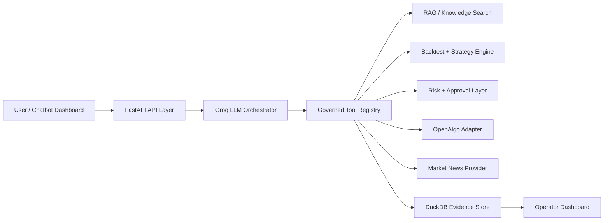

# IIMC Conversational Algo-Trading Platform

An AI-assisted algorithmic trading research platform that lets users interact
with market data, strategy backtests, broker readiness, and paper-trading
workflows through a conversational interface.

The system combines **Groq LLM orchestration**, **retrieval-augmented generation
(RAG)**, **FastAPI**, **DuckDB**, and **OpenAlgo broker APIs** to route
natural-language requests into governed backend tools. It is built as a
local-first research and execution-control workspace. Live trading is disabled
by default, but can be explicitly enabled for approval-gated live order intents.

## Submission Guide

This repository is self-contained for local academic review. No provider
credential is needed to inspect the architecture, run the full automated suite,
use the dashboard, import governed data, create/validate custom strategies, or
run deterministic research backtests. Conversational model, broker, and news
provider calls remain optional external integrations.

- [Architecture](docs/ARCHITECTURE.md) explains the system boundaries and data flow.
- [Operator Runbook](docs/OPERATOR_RUNBOOK.md) gives the local review workflow.
- [Data Domains](docs/DATA_DOMAINS.md) describes governed data coverage.
- [Security and Secrets](docs/SECURITY_AND_SECRETS.md) documents credential handling.
- [Production Readiness](docs/PRODUCTION_READINESS.md) distinguishes the local
  deliverable from deployment-scale work.

## Core Capabilities

- Conversational chatbot for market research, instrument discovery, backtesting,
  broker-state queries, and performance summaries.
- LLM tool orchestration with typed contracts, role gates, capability metadata,
  response grounding, and audit evidence for every tool-backed answer.
- Compound read-only chat questions can execute up to four independent governed
  tools, each with its own lifecycle and audit evidence. State-changing actions
  remain explicit, single-action workflows.
- RAG over project, architecture, policy, and trading workflow documents.
- Strategy backtesting with stored signals, risk decisions, order events, fills,
  and performance summaries.
- Custom strategy draft specs for no-code strategy ideas, with validation of
  EMA, SMA, RSI, ROC, ATR, VWAP, Bollinger, and MACD rules; unsupported
  primitives are reported for review rather than executed as arbitrary code.
- Trusted local strategy plugins with declared asset-class support and dynamic
  parameter schemas. Drop a plugin module into `strategy_plugins/` to make it
  available to the backtest API and Research view after restart.
  Rule definitions are editable JSON, validation-first, and support long or
  short deterministic research positions. They can also consume named
  point-in-time feature series, including IV/OI, earnings, fundamentals, and
  news/sentiment values, without generated code.
- Local governed OHLCV import for equity, index, futures, options, commodity,
  and crypto datasets, with candle validation, provenance hash, quality
  evidence, catalog visibility, and deterministic backtesting. Rich options
  chains retain their specialized ingestion path.
- OpenAlgo integration for quote, history, analyzer-mode status, funds,
  orderbook, tradebook, and positionbook checks.
- Broker-backed instrument discovery for NSE equities, NFO derivatives, and MCX
  commodities.
- Provider-backed market/news ingestion with raw response archival,
  normalization, deduplication, and DuckDB persistence.
- Web dashboard for chat, strategy runs, data catalog, OpenAlgo monitor,
  sandbox intents, reports, evaluations, and operational status.

## Architecture



The backend separates orchestration, services, repositories, and infrastructure:

- `iimc_trading_platform/api.py` exposes REST and dashboard routes.
- `iimc_trading_platform/orchestration.py` handles LLM tool selection and
  grounded response composition.
- `iimc_trading_platform/tools/registry.py` defines governed tool contracts.
- `iimc_trading_platform/services/` contains domain services for research,
  backtesting, risk, news, retrieval, OpenAlgo readiness, portfolio state,
  alerts, and evidence.
- `iimc_trading_platform/infrastructure/` contains DuckDB and OpenAlgo
  integration code.
- `iimc_trading_platform/frontend/` contains the browser dashboard.

## Safety Model

The project is designed for controlled research and paper-trading workflows:

- Tools declare input schemas, side effects, retry policy, required roles, and
  capability metadata such as supported actions, asset classes, execution modes,
  provider dependencies, and approval requirements.
- Natural-language custom strategies are stored as governed draft specs and
  must map to supported primitives or reviewed strategy plugins before
  backtesting/execution.
- Live trading is disabled unless explicitly enabled through configuration.
- Live order intents require a live-mode risk decision and mandatory human
  approval before OpenAlgo submission.
- Paper orders route through OpenAlgo analyzer mode and approval gates.
- Tool calls, approval decisions, broker snapshots, signals, risk decisions, and
  execution events are persisted for traceability.
- Missing providers fail safely; the platform does not fabricate market data,
  news, broker state, P&L, or backtest results.
- Secrets are loaded from local environment variables or ignored `.env` files,
  never from committed source.

## Quick Start

```powershell
python -m pip install -e .
python -m iimc_trading_platform.cli init-db
python -m iimc_trading_platform.cli verify-foundation
python -m uvicorn iimc_trading_platform.asgi:app --reload --host 127.0.0.1 --port 8001
```

Open the dashboard:

```text
http://127.0.0.1:8001/
```

## Local OHLCV Import

Use **Data Catalog > Local OHLCV Import** or `POST /datasets/ohlcv` to add
user-supplied candles for local research. The request requires a `dataset_id`,
asset class (`equity`, `index`, `futures`, `options`, `commodity`, or `crypto`), symbol,
exchange, interval, and at least two candles with `timestamp`, `open`, `high`,
`low`, `close`, and optional non-negative `volume`.

Every candle is checked for finite positive prices, valid OHLC bounds, and
unique timestamps. Invalid imports are rejected as a whole; the platform does
not repair or invent missing candles. Successful imports are stored in
`market_ohlcv`, cataloged with a SHA-256 source hash, and can immediately be
used by standard and governed custom-strategy backtests.
Plain options OHLCV is supported here. IV, OI, expiry, strike, and
option-surface research use the specialized options ingestion workflow; those
fields are intentionally not inferred from plain candles.

## Point-in-Time Feature Import

Use **Data Catalog > Point-in-Time Feature Import** or `POST /datasets/features`
to store any numeric feature series for a symbol and exchange. Each observation
requires `feature_name`, `observed_at`, `available_at`, and `value`; optional
metadata records source, revision, contract, or provider details. The platform
only aligns a feature after `available_at`, never from future observations.

Custom rule JSON declares each feature under `feature_inputs` with its dataset,
stored feature name, `alignment: "asof"`, and a positive `max_age_hours`. This
supports governed IV/OI, fundamentals, earnings, sentiment, and other numeric
alternative data while preserving source hashes and feature lineage in every
backtest manifest.

## Configuration

Copy `.env.example` to `.env` and fill only the providers you want to validate
locally.

Key settings:

```env
IIMC_LLM_PROVIDER=groq
GROQ_API_KEY=
GROQ_FALLBACK_MODEL=llama-3.1-8b-instant
IIMC_REQUIRE_REAL_LLM=true
IIMC_STRATEGY_PLUGIN_DIR=strategy_plugins

OPENALGO_BASE_URL=http://127.0.0.1:5000
OPENALGO_API_KEY=

MARKET_NEWS_PROVIDER=eventregistry
MARKET_NEWS_API_URL=https://eventregistry.org/api/v1/article/getArticles
MARKET_NEWS_API_KEY=

IIMC_ALLOW_LIVE_TRADING=false
IIMC_REQUIRE_PAPER_APPROVAL=true
```

## Useful Commands

### Add a local strategy plugin

Use [strategy_plugins/README.md](strategy_plugins/README.md) and the adjacent
`range_breakout.py.example` as the contract. Plugins are local trusted Python
modules: after adding a `.py` module, restart the platform and select its
declared strategy in Research. For conversational runs, use the explicit form:

```text
Backtest strategy range_breakout on dataset my_futures_5m with parameters {"lookback": 20}
```

Plain option-premium OHLCV behaves like any other dataset. For a chain ingested
through the specialized options workflow, select an expiry, strike, and call or
put contract before running the backtest.

Run health and schema checks:

```powershell
python -m iimc_trading_platform.cli doctor
python -m iimc_trading_platform.cli verify-foundation
```

Check OpenAlgo readiness:

```powershell
python -m iimc_trading_platform.cli openalgo-monitor
python -m iimc_trading_platform.cli openalgo-readiness `
  --symbol RELIANCE --exchange NSE --asset-class equity `
  --interval 5m --start-date 2026-06-24 --end-date 2026-06-26
```

Run the full automated suite:

```powershell
python -m unittest discover -s tests -v
```

Run a focused platform/API test subset:

```powershell
python -m pytest tests/test_api_chat.py tests/test_platform_api_routes.py tests/test_readiness_and_news.py -q
```

## Repository Structure

```text
iimc_trading_platform/     Core backend, services, tools, frontend, adapters
tests/                     Unit and integration-style tests
docs/                      Architecture, operations, security, and runbooks
scripts/                   Local verification and support scripts
deploy/                    Docker/Kubernetes deployment references
.github/workflows/         CI workflow
```

## Scope and Limitations

This is an AI-orchestrated trading research and controlled execution platform.
It does not claim guaranteed profitability, autonomous live trading, or verified
support for every broker instrument. Real provider behavior depends on configured
credentials, broker availability, market hours, and the instrument coverage
exposed by OpenAlgo.
