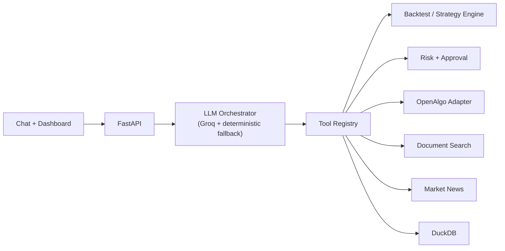

# Conversational Algo-Trading Platform

A local-first research platform for algorithmic trading that you drive through
plain-language chat. Ask for a quote, pull news, analyse a company, screen the
NIFTY 50, backtest a strategy you describe in English, or place and track an
order — all from one conversation, backed by real market data through
[OpenAlgo](https://openalgo.in).

Built with **FastAPI**, **DuckDB** (single-file storage), a **Groq**-routed LLM
orchestrator with a deterministic fallback, and a dependency-free vanilla-JS
dashboard. Live trading is off by default and every order requires your explicit
approval.

## What you can do (all from chat)

- **Market data** — live quotes and news; the symbol resolver refuses rather
  than guessing, so you never get the wrong company's price.
- **Research** — fundamental analysis from imported statements, and document
  search over reports/transcripts you upload.
- **Screening** — scan the NIFTY 50 for a technical condition
  (`"find NIFTY 50 stocks where RSI is below 30"`) using live candles.
- **Backtesting** — describe a strategy in English, review the compiled rules,
  and run it. History is fetched automatically; no manual data import.
- **Trading** — `"buy 10 RELIANCE at market"` prepares an order and shows an
  inline **Approve / Cancel** card in chat. Paper mode by default; live only
  when explicitly enabled. `"square off everything"` / `"cancel all orders"`
  work too.
- **Account** — funds, positions, orders, trades, and P&L, synced from the
  broker and shown on the landing page and the Account tab.

## Architecture



Key modules under `iimc_trading_platform/`:

| Path | Responsibility |
|---|---|
| `api.py` | REST + dashboard routes |
| `orchestration.py` | LLM tool selection and grounded responses |
| `tools/registry.py` | Typed tool contracts (schema, roles, side effects) |
| `services/` | Backtesting, risk, screener, news, retrieval, instrument names |
| `infrastructure/` | DuckDB and OpenAlgo integration |
| `frontend/` | Browser dashboard (no framework, no CDN) |

## Safety model

- Live trading is disabled unless explicitly enabled in configuration.
- Every order — paper or live — requires explicit human approval in chat before
  it reaches the broker.
- The assistant never fabricates prices, news, P&L, or backtest results; missing
  providers fail with a plain message.
- Secrets load from a local, git-ignored `.env` — never from committed source.

## Quick start

```bash
python -m pip install -e .
python -m iimc_trading_platform.cli init-db
python -m uvicorn iimc_trading_platform.asgi:app --reload --host 127.0.0.1 --port 8000
# open http://127.0.0.1:8000/
```

No credentials are needed to explore the dashboard, import data, build and
backtest strategies, or run the test suite. Live quotes/news/broker actions and
Groq-routed chat activate when you supply the matching keys.

## Configuration

Copy `.env.example` to `.env` and fill only the providers you want:

```env
GROQ_API_KEY=              # LLM chat; deterministic router runs without it
OPENALGO_API_KEY=          # live quotes, history, paper/live orders
OPENALGO_BASE_URL=http://127.0.0.1:5000
MARKET_NEWS_API_KEY=       # live headlines

IIMC_ALLOW_LIVE_TRADING=false
IIMC_REQUIRE_PAPER_APPROVAL=true
```

## Testing

```bash
python -m pytest tests/ -q
```

The suite has 300+ tests across routing, the strategy compiler, deterministic
backtests, the risk/approval state machine, the screener, and API contracts.
Run it as a single process — the tests share a local DuckDB file and will
collide if two runs overlap.

## Project structure

```text
iimc_trading_platform/   Backend, services, tools, frontend, adapters
tests/                   Automated tests
docs/                    Architecture and design notes
```

## Scope and limitations

A research and controlled-execution platform — not a guarantee of profit or a
fully autonomous trader. Real broker behaviour depends on your OpenAlgo
credentials, market hours, and instrument coverage. The company-name lookup
reads a local OpenAlgo master contract and falls back to the ticker when it is
absent.
