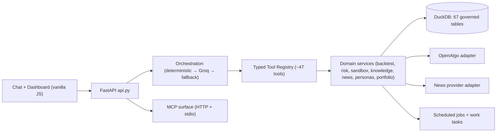

# Target Architecture

The platform is a **modular monolith** (FastAPI + DuckDB) with external services (OpenAlgo, Groq, news provider) behind adapters. This document describes the target shape; `ARCHITECTURE.md` describes module-level detail.

## Boundaries

- **LLM vs deterministic**: the LLM only routes intents and paraphrases tool JSON. All indicators, backtests, risk checks, order payloads, and account data come from typed deterministic tools. Deterministic guardrail responses are authoritative even when the LLM router is active.
- **OpenAlgo isolation**: only `infrastructure/openalgo.py` speaks OpenAlgo's wire format; services consume normalized models. OpenAlgo's internal DB is never touched.
- **Provider capability truth**: `/platform/summary` (asset coverage), execution readiness, and tool capability metadata drive what the frontend enables; missing credentials degrade only the affected capability with an explanation, never a synthetic fallback.

## Storage responsibilities (current → scale path)

| Concern | Today (single user, local) | Scale path |
|---|---|---|
| Transactional state (users, intents, approvals, audit, strategies) | DuckDB | PostgreSQL + Alembic migrations |
| Analytical series (OHLCV, options, features, curves) | DuckDB tables | DuckDB + Parquet partitions |
| Locks / idempotency | DuckDB atomic claims (`UPDATE … RETURNING`) | Redis |
| Streaming | 15s polling | WebSockets/SSE + Redis pub-sub |
| Artifacts | `artifacts/` filesystem (raw news JSON, reports, backups) | Object storage behind same abstraction |

The migration is additive: repositories already isolate SQL, so swapping stores does not touch orchestration, risk, or tool contracts.

## Key flows

- **Order (paper/live)**: request → intent validation (symbol/exchange/side/qty vs approved risk scope, freshness window) → approval (approver role, reason, audited) → atomic claim → analyzer/live submission → snapshot sync → audit. Live additionally requires `IIMC_ALLOW_LIVE_TRADING`, a LIVE-mode risk decision, and provider readiness with analyzer OFF.
- **Backtest**: dataset (with SHA-256 provenance + freshness) → strategy version → deterministic run → persisted signals/risk decisions/orders/fills/equity curve → evidence-linked report.
- **Task lifecycle**: `queued → running → succeeded | failed | retry` persisted in `work_tasks`/`job_runs` with attempts and error reasons; long runs never block HTTP requests.

## Deployment topology

Local dev: single uvicorn process + DuckDB file. Containerized: `deploy/` Docker/Kubernetes references with health probes (`/live`, `/ready`), env-only secrets, persistent volume for the DuckDB file and artifacts.
